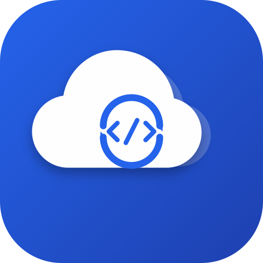

# CodeSync 代码同步助手

<div align="center">



**一款轻量级、跨平台的代码上下文同步工具，专为辅助 AI/LLM 编程设计。**

[**English**](README.md) | [**下载最新版本**](../../releases)

</div>

---

## 📖 简介

**CodeSync** 旨在解决使用大语言模型（LLM）编程时的“上下文窗口”管理难题。它可以让你有选择地将本地项目的目录结构和文件内容打包，并同步到你的私有服务器，生成一份 AI 易于阅读的文本格式。

使用 **CodeSync**，你不再需要手动复制粘贴数十个文件。只需选择项目文件夹，勾选需要的文件，一键同步即可。

## ✨ 主要特性

* **🖥️ 全平台支持:** 原生支持 Windows、macOS 和 Linux。
* **☁️ 私有部署:** 基于 Docker 轻松部署私有同步服务，数据掌握在自己手中。
* **🧠 智能过滤:** 自动读取并遵守 `.gitignore` 规则，排除无关文件。
* **⚡ 智能同步:** 基于哈希对比，仅上传发生变更的文件内容，节省带宽。
* **🎨 现代化 UI:** 支持深色/浅色主题切换，跟随系统设置。
* **🌍 多语言:** 内置中、英文界面，可随时切换。
* **📂 结构可视化:** 自动生成项目的 ASCII 树状图，帮助 AI 理解引用关系。

---

## 🚀 服务端部署教程 (Docker)

为了使用同步功能，你需要先在服务器上部署后端服务。推荐使用 Docker Compose。

### 准备工作
* 一台安装了 Docker 的服务器。
* 确保指定端口未被占用。

### 第一步：创建配置文件
下载[docker-compose.yml](server/docker-compose.yml)到目标文件夹

**或者**

在目标文件夹创建一个名为 `docker-compose.yml` 的文件，并填入以下内容：

```yaml
version: '3.8'

services:
  codesync-server:
    # 官方镜像地址
    image: ghcr.io/ryanzhou416/codesync/codesync-server:latest
    container_name: codesync_server
    # 自动重启策略
    restart: always
    ports:
      # 端口映射: "主机端口:容器端口"
      # 你可以修改左边的 8000 为任意你想要的端口
      - "8000:8000"
    environment:
      - PYTHONUNBUFFERED=1
````

### 第二步：启动服务

在 `docker compose.yml` 所在的目录下运行以下命令：

```bash
docker compose up -d
```

启动成功后，服务端将监听 `http://你的服务器IP:8000`。

-----

## 💻 客户端使用指南

### 1\. 安装软件

从 [Release](../../releases) 下载对应系统的安装包：

  * **Windows:** 下载并运行 `CodeSync_Setup_x*.exe`。
  * **macOS:** 下载 `CodeSync.dmg` 并将应用拖入应用程序文件夹。
  * **Linux:** 下载二进制文件或安装 `.deb` 包。

### 2\. 配置项目

1.  打开 **CodeSync** 软件。
2.  在顶部 **项目管理 (Project Management)** 区域：
      * **项目名 (Name):** 输入一个唯一标识（例如 `MyWeb`）。
      * **服务器 (URL):** 输入你的服务器地址（例如 `http://192.168.1.100:8000` 或域名）。
      * **本地路径 (Path):** 点击 **浏览 (Browse)** 选择你的代码根目录。
3.  点击 **保存 (Save)** 按钮。

### 3\. 同步代码

1.  文件树会自动加载。
2.  **勾选** 你希望 AI 读取的文件。
      * *提示:* 左侧点击文件名可多选，配合上方“勾选高亮项”按钮可批量操作。
3.  点击右下角的 **开始同步 (Start Sync)**。
4.  客户端会将文件结构和内容打包发送至服务器。

### 4\. 获取上下文

同步完成后，你（或者你的 AI Agent）可以通过浏览器访问以下地址获取完整的代码上下文：
`http://你的服务器IP:8000/MyWeb`

-----

## 🛠️ 本地开发与构建

如果你想参与开发或从源码构建：

### 环境要求

  * Python 3.9+
  * `pip`

### 运行步骤

```bash
# 1. 克隆仓库
git clone [https://github.com/ryanzhou416/codesync.git](https://github.com/ryanzhou416/codesync.git)
cd codesync

# 2. 安装依赖
pip install -r requirements.txt

# 3. 运行客户端
python src/main.py

# 4. 运行服务端 (本地测试)
cd server
python server.py
```

-----

## 📄 许可证

本项目基于 MIT 许可证开源。